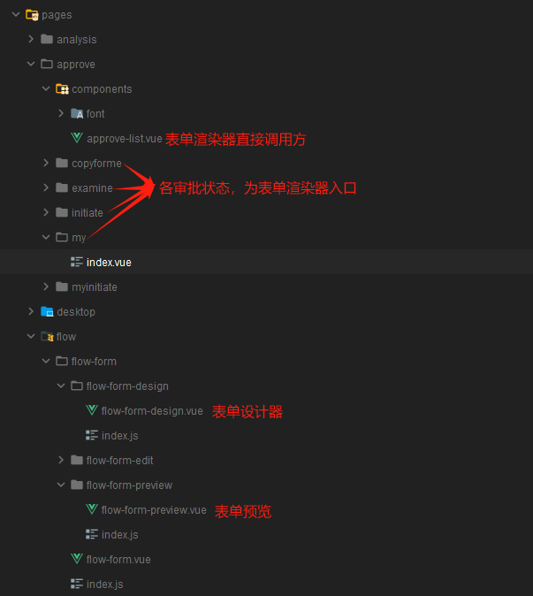
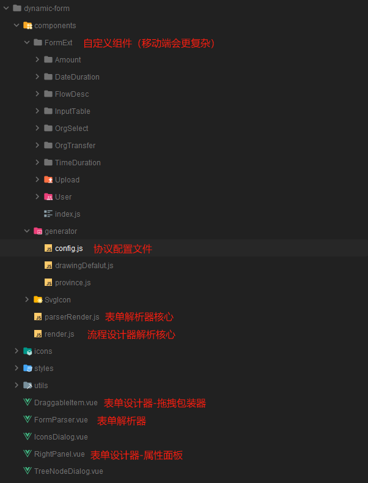
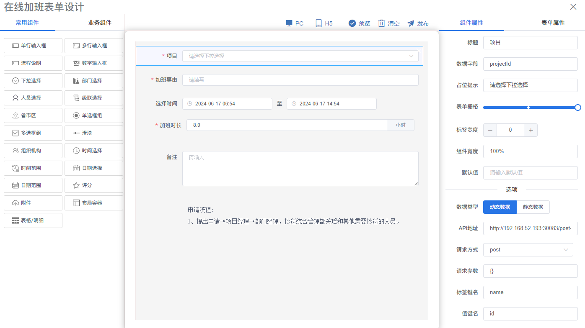
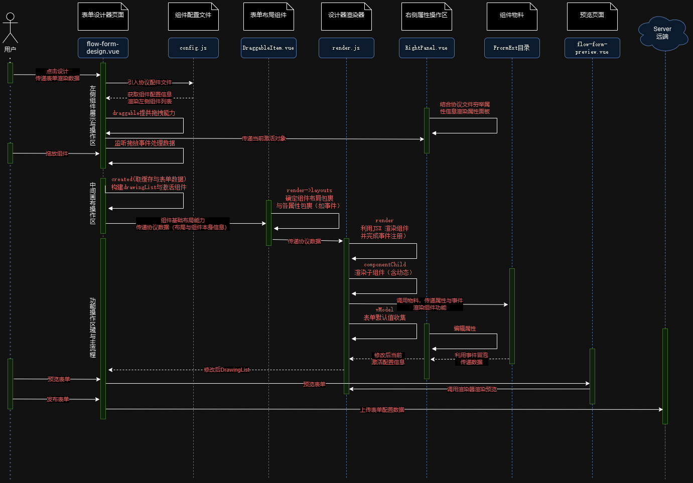
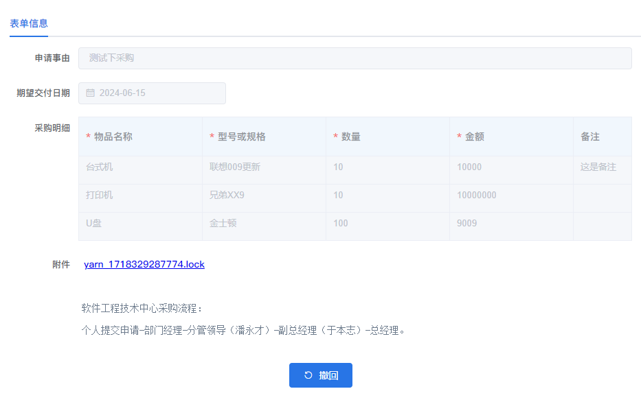
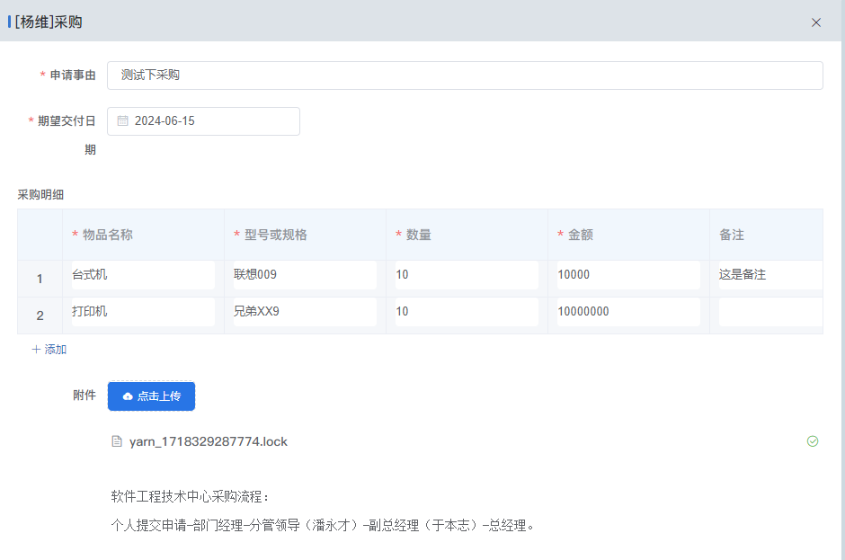
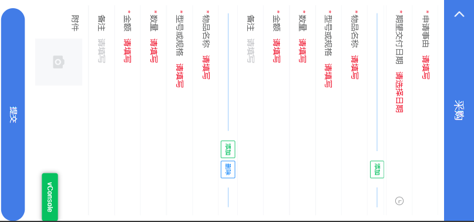
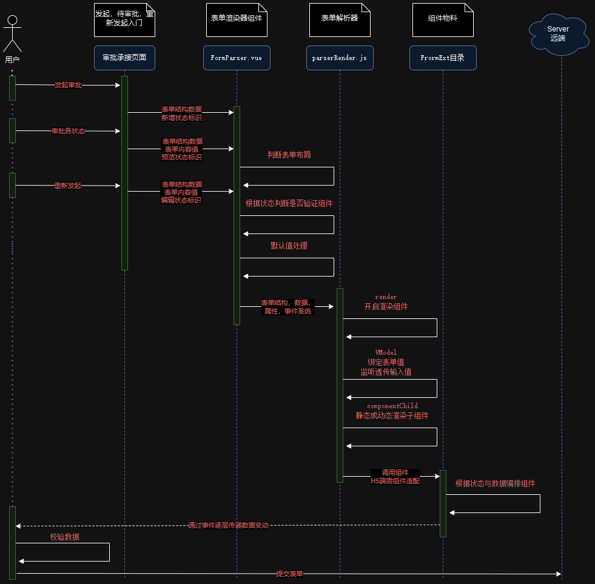
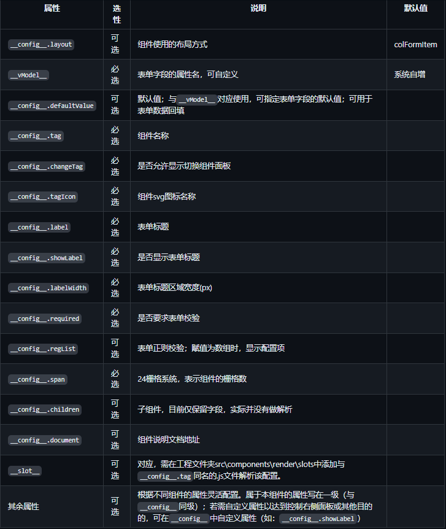
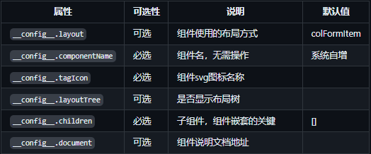

<!-- [TOC] -->

## <!-- 目录存在 md 兼容性问题 -->

---

这些区域为学习内容

- 标题居中
<h1 align="center">
  Douyin-Vue
</h1>

- 块元素包裹行内
<p align="center">
 <a href="README.en.md">English</a> | <a href="README.es.md">Spanish</a> | <a href="README.de.md">German</a> | 
<a href="README.fr.md">French</a> | <a href="../README.md">简体中文</a> |  <a href="README.ja.md">日本語</a> 
</p>
- 图片区域大小与行内
<div>


</div>

---

# 可视化动态表单系统设计文档(v1.0)

## 项目概述

**项目背景**

结合公司工作流业务系统，需要大量风格不一的表单系统，如采用传统软件开发方式，开发大量表单界面通常需要大量的前端代码，且严重缺乏扩展性，综合调研考虑，采用可视化动态表单方式完成业务功能开发。

**主要优势**

1. **易于使用：** 对于非专业程序员来说，低代码表单设计器提供了一个直观、易用的图形界面，使得创建和修改表单变得简单明了。
2. **提高效率：** 由于大量的重复性工作被自动化，开发者可以更快地创建和部署表单，从而提高了工作效率。
3. **灵活性：** 低代码表单设计器通常提供了一系列预制的组件和模板，用户可以根据需要选择和组合这些组件，以创建出符合自己需求的表单。
4. **降低成本：** 由于开发过程被大大简化，企业可以减少在表单开发上的投入，从而降低开发成本。

**主要功能**

1. **丰富的组件配置扩展能力：** 由于基于 ElementUI 进行扩展，针对常见基础组件*对标原组件扩展点属性*，提供有效的功能扩展点（如单行文本：提供站位提示，表单栅格，标签宽度等设置项），针对部分需要关联外部数据源组件，进行能力增加，==可提供动态数据源能力==。
2. **简洁的第三方组件植入能力：** 依靠高效的组件解析器与协议，可低成本的植入外部组件。
3. **端适配能力：** 通过对协议添加适配器，低成本，简洁，高效率完成==移动端，PC 端解析的一致性，与差异化==。
4. **接入低成本能力：** 利用`JSX`,对表单增加，编辑，显示三种状态，结合组件状态隔离，完美实现业务需求，同时提供简单的调用方式，打通与外部系统通信，形成闭环。

**系统不足与使用限制**

1. ==定位于表单设计，基础架构相对薄弱，无法有效支持交互较复杂项目==，故无法与其他企业成熟的全流程低代码平台进行比较。
2. 对于特别复杂或特定的需求，可能仍需要提供定制化的组件能力增强手动开发。

## 实现核心原理

1. [可扩展的解析协议](#协议文档) 提供解析的物料组件范围，与属性扩展能力。
2. [渲染函数 & JSX](https://cn.vuejs.org/v2/guide/render-function.html) 提供动态渲染解析能力。

3. **原理总结：**

- 通过协议定义好了组件的种类与数据结构（主要为属性设置项），表单设计器完成对组件 JSON 的编辑操作，保存至服务端，
- 当渲染页面组件时，下发保存在服务端 JSON 配置项，由表单解析器利用 JSX，结合组件状态数据，事件，插槽，子组件递归，完成表单渲染
- 当操作时，利用提前注册好的事件系统传递数据至第三方，当需要获取表单数据，表单校验时，提供 Ref,相关获取数据方法提供内部数据。

```javascript
//表单协议
{
  label: '时间范围',
  tag: 't-time-duration',
  componentType:'time',
  showDuration: false,
  tagIcon: 'time-range',
  defaultValue: null,
  span: 24,
  labelWidth: null,
  style: { width: '100%' },
  disabled: false,
  clearable: true,
  required: false,
  'is-range': true,
  'range-separator': '至',
  'start-placeholder': '开始时间',
  'end-placeholder': '结束时间',
  format: 'HH:mm:ss',
  'value-format': 'HH:mm:ss',
  regList: [],
  changeTag: true,
  proCondition: true,
  asSummary: false
}
```

```javascript
//属性配置
const dataObject = {
  attrs: {},
  props: {
    formData: this.formData,
    value: this.value || confClone["defaultValue"],
    isFormEdit: this.isFormEdit || false,
    //TODO:provide inject to optimize
    isReDo: this.isReDo,
  },
  on: {},
  style: {},
};
//vue render 方式
return h(
  this.conf.tag,
  dataObject,
  children.length > 0 ? children : this.optionList
);
//jsx 与递归
conf.options.forEach((item) => {
        list.push(
        <el-option
            label={item.label}
            value={item.value}
            disabled={item.disabled}
        ></el-option>
        );
    });
    !this.optionList && (this.optionList = list);
    }
//紧密围绕状态展开的自定义组件
    props: {
      config: {
        type: Object,
        default: () => {},
      },
      value: {
        type: Array,
        default: () => [],
      },
      isFormEdit: {
        type: Boolean,
        default: false,
        required: false,
      },
      isReDo: {
        type: Boolean,
        default: false,
        required: false,
      },
      formData: Object,
    }


```

## 详细设计

### 项目主体结构

1. **页面入口-调用方**
   

2. **核心部件**
   

### 表单设计器

进入网站映入眼帘的就是设计器组件，该组件包含了以下部分

1. 左侧物料展示区
2. 上方工具栏
3. 中间物料渲染区
4. 右侧物料属性编辑区



#### 设计器时序图



#### 设计器实现

##### 物料展示区

物料其实就是可供选择的表单组件。这块的功能就是展示所有物料，然后通过拖拽或者双击，将选择的物料渲染到中间的物料渲染区,其原理过程解释如下

1. 定义物料
   定义好了一系列的物料 JSON(见 `config.js`)，把它显示到左侧物料展示区
   整体原则为对于 Element 原始组件，需根据原始文档初始化配置属性参数，对于自定义组件结合业务需要进行属性设置

2. 展示物料
   循环遍历 config.js 物料信息，展示物料区
3. 分组拖拽
   利用 vue-draggable，实现可拖拽，监听拖拽事件实现数据传递
4. 核心数据解构
   - drawingList-拖拽表单数据集
   - activeData-当前激活的组件配置信息（为 drawingList 的子集）

##### 物料渲染区

拖拽物料之后，需要渲染出实际的组件，以下为渲染区域核心解释

1. 根据 drawingList 动态渲染表单
2. draggable-item 解析布局与画布操作（删除，移动等）

   ```javascript
   colFormItem(h, element, index, parent, root) {
    const { activeItem } = this.$listeners
    let className = this.activeId === element.formId ? 'drawing-item active-from-item' : 'drawing-item'
    if (this.formConf.unFocusedComponentBorder) className += ' unfocus-bordered'

    return (
      <el-col span={element.span} class={className}
        nativeOnClick={event => { (activeItem(element),event.stopPropagation()) }}>
        <el-form-item label-width={element.labelWidth ? `${element.labelWidth}px` : null}
          label={element.label} required={element.required}>
          <render key={element.renderKey} conf={element} onInput={ event => {
            this.$set(element, 'defaultValue', event)
          }} />
        </el-form-item>
        { components.itemBtns.apply(this, arguments)}
      </el-col>
    )
   }

   ```

3. render.js 渲染器
   - 利用 JSX 直接根据标签名称渲染对应组件，透传进属性，绑定事件回调
   - 针对存在 children 组件组件,利用 JSX 分片渲染插入（包含动态 API 数据插入）
   - 表单设计器的渲染器仅做展示，在数据校验，真实数据传递上与表单渲染器存在较大差异，==因而表单设计器渲染器与表单组件解析器分开设计==

##### 属性设置区

1. 穷举协议文件属性，绘制属性设置面板
2. 根据 activeData 展示当前组件属性，由于引用传递，修改后 drawingList 发生改变出发渲染器重绘

##### 顶部操作区

1. 保存-drawingList 至 server 端
2. 预览-drawingList 提供数据，利用表单渲染器实现预览

### 表单解析器

表单解析器组件负责解析表单配置文件，完成页面表单效果海还原，包含==新增，展示，编辑==三种状态，同时包括 PC 与 H5 端适配

**表单渲染器显示-pc**

**表单渲染器添加与编辑-pc**

**表单渲染器添加-h5**


#### 表单渲染器时序图



### 渲染器实现

#### FormParser.vue 组件

直接对外暴露的渲染器组件，其**实现方式**如下

- 利用表单描述数据还远组件布局
- 根据状态确定验证规范
- 监听内部组件值传递
- 调用渲染函数解析组件

#### parserRender.js 组件

本组件负责内部组件解析，还原页面效果其**实现方式**如下

- 直接利用 JSX 渲染函数组件
- 根据状态确定渲染逻辑
- 监听内部组件值传递，向上抛出组件值

#### H5 端适配策略

由于 H5 端与 PC 交互存在较大差异，编写 adapterH5.js 对原 PC 渲染器做**无侵入性适配**，其核心代码如下

```javascript
//适配枚举
export const adapterTagMap = {
  "el-input": "van-field",
  "el-input-number": "van-field",
  "el-select": "t-select",
  "el-cascader": "van-cascader",
  "el-radio-group": "t-radio-button",
  "el-checkbox-group": "van-checkbox-group",
  "el-slider": "van-slider",
  "el-time-picker": "t-date-select",
  "el-date-picker": "t-date-select",
  "el-rate": "van-rate",
  "t-date-duration": "t-date-duration-select",
  "t-time-duration": "t-date-duration-select",
};
//组件属性与事件适配
export const adapterComponent = (ctx, dataObject) => {
  //共性适配，统一转换
  const ruleList = findParentComponent(ctx, "form-parser").ruleList;
  dataObject.props.rules = ruleList[ctx.conf.vModel];
  dataObject.props.rules?.length > 0 &&
    (dataObject.props.rules[0].trigger = "onBlur") &&
    delete dataObject.props.rules[0].type;
  !ctx.conf?.labelWidth && (dataObject.props.labelWidth = "6.2em");
  dataObject.props.name = ctx.conf.vModel;
  dataObject.props.conf = ctx.conf;
  return {
    //具体组件具体转换逻辑处理
    "el-input": (type) => {
      if (type === "textarea") {
        dataObject.attrs = {
          ...dataObject.attrs,
          rows: ctx.conf.autosize.maxRows.toString(),
          "show-word-limit": ctx.conf["show-word-limit"],
        };
        dataObject.props = {
          ...dataObject.props,
          "show-word-limit": ctx.conf["show-word-limit"],
        };
      }
    },
    "el-input-number": (type) => {
      dataObject.props.type = "number";
    },
    "el-select": (type) => {},
    "el-cascader": "van-cascader", //todo
    "el-radio-group": (type) => {
      dataObject.props = {
        ...dataObject.props,
        type: "time",
        columns: ctx.conf.options,
      };
    },
    "el-checkbox-group": "van-checkbox-group",
    "el-slider": "van-slider",
    "el-time-picker": (type) => {
      dataObject.props = {
        ...dataObject.props,
        type: "time",
        format: "HH:mm",
        "value-format": "",
      };
    },
    "el-date-picker": (type) => {},
    "el-rate": "van-rate",
    "t-date-duration": (type) => {},
    "t-time-duration": (type) => {},
  };
};
```

### 物料组件设计

#### 设计原则

1. 自定义组件应包含以下三大核心状态属性，支撑业务需要，部分组件结合业务进行了定制

   - **isFormEdit**-是否可编辑
   - **isReDo**-是否重做（是否再次编辑）
   - **value**-表单组件值

2. 内置原始组件采用 Elemntui 与 vant 请结合属性进行配置使用
3. 所有组件应采用事件传递值
4. 需考虑 H5 与 PC 交互上的差异进行扩展

### 协议文档

本设计器目前支持的布局方式为

- colFormItem：生成 el-col 包裹的组件布局
  
- rowFormItem：生成一个空的 el-row
  

### 参考文献

- [Variant Form 一款高效的 Vue 低代码表单，可视化设计](https://github.com/vform666/variant-form)
- [Element UI 表单设计及代码生成器](jakhuang.github.io/form-generator)
- [表单设计的一般流程](https://www.yuque.com/visualdev/vform/nuhvrw)
